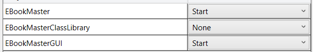

## Before start the application run "update-datebase" in the NuGet package console (make sure to have Sql Server installed)

## To start the application in Visual Studio set multiple startup projects 

## To test the application in Librarian mode use edward.norton@example.com with password "asd"

## To Test the application in Reader mode use bob.smith@example.com with password "asd"
